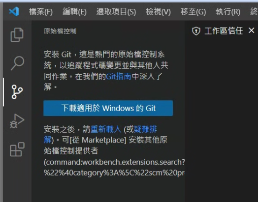
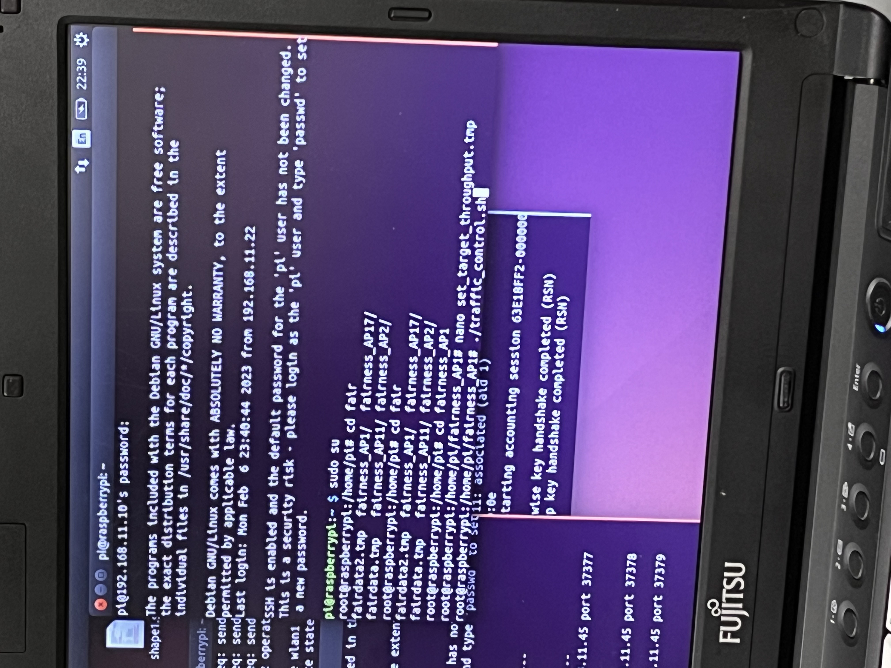

<div style="text-align: center; font-size: 48px; font-weight: bold;">   日本岡山大學學習日誌 </div>

------


<div style="font-size: 24px; font-weight: bold;">   目錄 </div>


[TOC]

# GitHub鏈結visual studio code操作

> ​	GitHub鏈結visual studio code有許多好處，可以提供多人共同編輯程式碼，或者是在自己的分支上工作，也可以在GitHub註記程式碼有哪些內容進行更動，以下分享如何將GitHub鏈結在visual studio code

## 安裝git指令到電腦上

​	打開visual studio code首頁的原始檔控制，在使用GitHub程式庫之前，必須先安裝git才能作用。



​	Git 是一種**分散式版本控制系統**，用於追蹤文件的變更，特別是代碼的變更。Git 提供了靈活且高效的分支管理功能，使得在不同的功能或修補程式之間切換變得非常簡單。合併操作通常也很流暢，即使發生衝突，Git 也提供了強大的工具來幫助解決。[git指令下載連結](https://git-scm.com/)


安裝過程不需要特別選取甚麼特別的，一直下一步就行了。


安裝完成後就可以在vs code上看到git指令（記得先重新整理畫面）。


## 將自己的GitHub程式庫鏈結到vs code

​	首先先到GitHub上將程式庫連結複製。


接著在vs code輸入以下指令（為了在本機電腦中開個資料夾存放GitHub程式庫）。


將複製的程式庫連結貼上。


接著登入GitHub。


使用git指令也需要在**終端機命令列（cmd）**輸入自己的github帳號密碼，指令如下：

```
git config --global user.name "yourname"
git config --global user.email "youremail"
```

輸入完成可以使用list指令確認有無綁定帳號。

```
git config --list
```

**yourname**是GitHub帳號名，**youremail**是這個GitHub帳號的email，輸入畫面如下：


確認畫面


## 在vs code撰寫程式並上傳至github

在還未上傳程式前，GitHub只有README.md這個檔案而已。


現在嘗試在本地電腦寫一個test.txt並上傳至GitHub，首先先在資料夾新增檔案test.txt寫文字並儲存。


切換到**原始檔控制**可以看見剛剛變更的檔案出現在**變更欄**中，接著**點+暫存所有變更**


接著所有的變更都會跑到**暫存的變更欄中**，可以將**暫存的變更欄**想成是一個籃子，負責將所有想上傳到GitHub的變更通通打包，接著按下**提交**就會將**暫存的變更欄**中所有變更推送到GitHub程式庫中，記得在上方**訊息**註記文字才可推送變更，這裡我寫first，這些註記將會和程式一起上傳到GitHub。


接著按同步變更。


回到GitHub程式庫可以看到已經將test.txt上傳了，並且後方有註記first。


​	大致上傳檔案的流程如上，因為日本的學長說**GitHub+vscode**是非常常用的程式，很多公司的專案都是利用這個功能團隊分工，所以想說詳細記錄一下讓自己提早熟悉，我覺得github強大的地方在每個人都能看到你的變更以及註記，每次的變更都有註記告訴團隊每個人變更了哪些程式。

## 創建個人的分支

​	分支的概念就是個人獨立開出一個小區域存放自己的程式，人人彼此之間的程式是不衝突的，可以獨自創建分支來存放自己的資料，以下說明如何透過vscode創立分支。

​	首先先道延伸模組**下載git graph**，這可以讓我們簡單選取分支方便閱讀。


點開**原始檔控制**可以看到目前只有main這個分支。


接著**新增一個名為jacky的分支**並上傳到GitHub。


命名為jacky。


上傳分支到GitHub。


到GitHub可以看到jacky分支被上傳了。


回到vs code可以看到我們可以自由選取自己的分支，來決定變更的檔案要上傳到哪個分支上，圖中粗體部分(jacky)為現在我們在哪個分支上。


也可透過vs code左下角確認。


接著我們嘗試在jacky分支上傳檔案，先新增一個文字檔jacky_test.txt，並更動內容。


切換到**原始檔控制**，確定目前在jacky分支上，並照剛剛的做法上傳到github。


可以看到剛剛新增的檔案**jacky_test.txt**已經上傳到**jacky分支**上了。


​	接著就能在自己的分支上執行自己的任務，一開始**jacky分支**會繼承**main分支**的內容，因為分支原本的功能就是在不影響最大的程式的情況下，開發其他新功能，最後在整併回去主要的**main分支**，只是在岡山這裡學長利用分支的功能來當成開不同獨立的資料夾來讓我們作業XD，以後有機會的話再嘗試使用GitHub分支來開發大型的程式。


# 研究前導讀論文

> 深入了解研究課題，閱讀參考文獻內容，需要掌握以下幾點：
>

## 吞吐量控制方法是基於什麼等式關係進行計算的？

$$
\frac{C_1}{S_1}+\frac{C_2}{S_2}+\cdots+\frac{C_n}{S_n}=constant\\C_n:第n個\space host\space 的\space concurrent\space\space throughput\\S_n:第n個\space host\space 的\space single\space\space throughput
$$

> [!TIP]
> $$
> \begin{flalign}
> &concurrent\space\space throughput:為環境中有多個\space host\space存在時的吞吐量&
> \end{flalign}
> $$
>
> $$
> \begin{flalign}
> &single\space\space throughput:為環境中只有單一個\space host\space存在時的吞吐量&
> \end{flalign}
> $$

## 為什麼會出現吞吐量不公平或者不足的現象？

​	主機和AP之間的距離差異，導致信號強度和吞吐量的不同。 WLAN環境中的⼲擾和衝突。 主機設備的硬件限制或應⽤程序的帶寬需求不同。

## 在吞吐量控制方法的實現過程中，具體是使用什麼技術進行的？

​	使⽤了流量整形技術，流量整形技術可以通過排程、監管、整形和分類網絡流量， 為特定⽤⼾提供保證的帶寬服務。在Linux中，可以使⽤流量控制（tc）命令進⾏流量整形。 tc命令有三個組件：排隊紀律（qdisc）、類別（classes）和過濾器（filters）。

## 圖示或者文字說明如何使用通道佔用時間（Channel Occupancy Time）來表征？

***EX***

通道時間總共10秒，A設備佔用了4秒、B設備佔用了3秒、C設備佔用了2秒，這個通道的通道佔用時間（Channel Occupancy Time）為**4+3+2=9s**，通道占用率為：
$$
\frac{4+3+2}{10}=90\%
$$

## 自行在網路上了解什麼是**traffic shaping**

 	Traffic shaping(流量整形)是⼀種網路頻寬管理技術（Bandwith Mangement），透過限制 頻寬（bandwidth）的⽅法以滿⾜ Commited Information Rate（CIR，中⽂譯為承諾訊息率），將超出CIR的數據放入buffer，維持流量穩定。

Traffic shaping 通常使⽤兩種⽅法來調節頻寬： 

- Leaky Bucket：這種⽅法將數據包以固定速率輸出，當輸入速率超過輸出速率 時，多餘的數據包會被暫時存儲在緩衝區中。 
- Token Bucket：這種⽅法通過⽣成Token來控制數據包的傳輸，每個數據包需 要消耗⼀定數量的Token才能通過，當Token不⾜時，數據包需要等待。

## 了解Linux系統關於**if 指令**以及**iw指令**的內容

- if指令

  ```
  if [conditon 1]; then
  	#命令1
  elif [condition 2]; then
  	#命令2
  else
  	#命令3
  ```

- iw指令

  | 功能              | 程式碼                                   |
  | ----------------- | ---------------------------------------- |
  | iw list           | 查看本機⽀持的無線特性                   |
  | iw dev wlan0 scan | 掃描無線網絡，列表的內容都是實時更新的   |
  | iw dev wlan0 link | 獲取設備連接狀態信息（實測不包含IP地址） |
  | iw wlan0 info     | 獲取設備⼯作狀態信息                     |
  | iw event          | 獲取所有網絡設備的⼯作⽇誌信息           |

## 了解Linux系統關於**tc command**的內容

| 功能                     | 程式碼                                     |
| ------------------------ | ------------------------------------------ |
| 列出網絡接⼝及其配置信息 | tc qdisc show                              |
| 添加 root 類             | tc qdisc add dev  root                     |
| 添加⼦類                 | tc class add dev  parent                   |
| 添加過濾器               | tc filter add dev  parent                  |
| 配置帶寬限制             | tc class change dev  parent                |
| 設置延遲                 | tc qdisc change dev  parent  handle  netem |
| 刪除配置                 | tc qdisc del dev  root                     |

## 了解WLAN通信協議的特點和類型

- 802.11n
- 802.11ac
- 拓展：802.11ax

|              | 802.11n     | 802.11ac    | 802.ax      |
| ------------ | ----------- | ----------- | ----------- |
| **傳輸頻率** | 1.2Gbps(慢) | 3.5Gbps(中) | 9.6Gbps(快) |
| **頻段**     | 2.4&5GHz    | 5GHz        | 2.4&5GHz    |
| **安全性**   | WPA2(低)    | WPA2(低)    | WPA3(高)    |
| **調變**     | 64QAM       | 256QAM      | 1024QAM     |

## 我們的實驗環境是什麼？

+ **實驗設備配置**

  樹莓派、網卡(TP LINK, RTL)

+ **實驗的信道（channel）設置**

  2.4和5GHz，為非重疊的通道

+ **實驗的帶寬（bandwidth）設置**

  40兆赫茲

# 流量調整程式碼

## 清除之前設定以及設定目前環境

```bash
#!/bin/bash
#This scripts for delete the traffic shaping from the network.

# 設定網路介面變數
# Interface connect to out lan
int1="wlan0"
# Interface virtual for incomming traffic
tin1="ifb0"

#清除網路介面上的qdisc設定
# Clean interface
sudo tc qdisc del root dev $int1
# Clean interface
sudo tc qdisc del dev $int1 handle ffff: ingress

sudo tc qdisc del root dev $tin1
```

## 用於幫每個主機配置各自的流量

```bash
#!/bin/bash
#This scripts control incomming and outcomming bandwight in a linux router box

dir=/home/pi/fairness_AP1  #指定配置文件的目錄。
unit=mbit  #設定帶寬單位為Mbit。
# Interface connect to out lan
int1="wlan0"  #設定連接到LAN的網路介面
# Interface virtual for incomming traffic
tin1="ifb0"  #設定虛擬介面，用於進入流量

#使用wc -l命令從文件set_target_throughput.tmp中讀取總數據速率。
totalDatarate=$(< $dir/set_target_throughput.tmp wc -l)

#使用awk從文件中讀取每個IP和對應的數據速率，並存儲在陣列IP和datarate中。
w=1
while [ $w -le $totalDatarate ]
do
  IP[$w]=$(awk -v var=$w 'FNR==var{print $1}' $dir/set_target_throughput.tmp)
  datarate[$w]=$(awk -v var=$w 'FNR==var{print $2}' $dir/set_target_throughput.tmp)
  w=$(( w+1 ))
done

#累加所有的數據速率，計算出總數據速率total_th
w=1
total_th=0
while [ $w -le $totalDatarate ]
do
  total_th=$(echo "scale=10; $total_th + ${datarate[$w]};" | bc -l) # add the total datarate for parent class
  w=$(( w+1 ))
done

#使用modprobe載入ifb模組，並將虛擬介面tin1啟用
modprobe ifb numifbs=1
sudo ip link set dev $tin1 up

## Limit incomming traffic ( to localhost)
# Clean interface(清除之前的qdisc設定)
sudo tc qdisc del dev $int1 handle ffff: ingress
#modprobe -r ifb(設定新的qdisc來限制進入流量)
sudo tc qdisc del root dev $tin1
sudo tc qdisc add dev $int1 handle ffff: ingress
# Redirect  ingress wlan0 to egress ifb0(並將wlan0的進入流量重新導向到ifb0)
sudo tc filter add dev $int1 parent ffff: protocol ip u32 match u32 0 0 action mirred egress redirect dev $tin1
# Add classes per ip(新增根類別)
sudo tc qdisc add dev $tin1 root handle 2: htb default 80

#設置總數據速率
sudo tc class add dev $tin1 parent 2: classid 2:1 htb rate $total_th$unit  # create parent class

# distribute data rate to the host (child class)
#為每個IP新增子類別，分配對應的數據速率
w=1
class_id=10
while [ $w -le $totalDatarate ]
do
sudo tc class add dev $tin1 parent 2:1 classid 2:$class_id htb rate ${datarate[$w]}$unit ceil ${datarate[$w]}$unit
w=$(( w+1 ))
class_id=$(( class_id+10 ))
done

#新增過濾器，將流量根據IP匹配到對應的類別
w=1
class_id=10
while [ $w -le $totalDatarate ]
do
sudo tc filter add dev $tin1 parent 2: protocol ip prio 1 u32 match ip src ${IP[$w]} flowid 2:$class_id
w=$(( w+1 ))
class_id=$(( class_id+10 ))
done
```

# 配置樹梅派作為一個Access Point（AP）

## hostapd下載及安裝

​	**hostapd**（Host Access Point Daemon）是一個能將無線網卡轉換為無線接入點（Access Point）的軟件。它允許主機充當無線網絡的接入點，從而使其他設備（如筆記本電腦、智能手機等）可以連接到該網絡。

​	**hostapd** 是一款強大的 Linux 軟件，能將計算機轉換成 Wi-Fi 熱點，提供無線網絡連接，支持 WPA/WPA2 安全協議，增強網絡安全。它可以配置多個 SSID，在同一網卡上運行多個虛擬無線網絡，支持 VLAN 將不同 SSID 綁定到不同 VLAN，以實現網絡隔離和分段。

### 使用apt指令下載

```bash
sudo apt-get upgrade
# upgrade（可以跳過）
# 如果對hostapd版本有要求最好更新一下：
sudo apt-get update
sudo apt-get install hostapd
```

### 下载dnsmasq

​	**dnsmasq** 是一個輕量級的 DNS 轉發器、DHCP 服務器和網絡引導提供程序，專為小型網絡而設計。它在嵌入式設備中非常流行，如路由器和小型家用伺服器。使用以下指令下載：

```bash
sudo apt-get install dnsmasq
```

### 為無線接口配置靜態IP

​	首先**使用以下指令開啟dhcpcd.config**，`dhcpcd.config` 是 dhcpcd（DHCP Client Daemon）的配置文件，用於配置 DHCP 客戶端行為。

```bash
sudo nano /etc/dhcpcd.config
# 新增wlan1的介面訊息
#（因為我們使用external NIC作為無線網卡，
# 所以介面不是樹莓派板載的wlan0，
# 而是使用wlan1，通常為了防止幹擾會停用wlan0）
```

建議在開啟`dhcpcd.config`之前先將有關的程式關掉。

```bash
sudo systemctl stop hostapd
sudo systemctl stop dnsmasq
```

進入到`dhcpcd.config`之後在行末添加有關ip地址以及dns的資訊，並且配置一個網路接口`wlan1`。

```bash
interface wlan1 #指定配置的網絡接口
static ip_address=192.168.11.1/24 #為接口 wlan1 分配靜態 IP 地址。
static routers=192.168.0.1 #設置默認路由器
static domain_name_servers=192.168.0.1 8.8.8.8 fd51:42f8:caae:d92e::1 #設置DNS伺服器
# denyinterfaces eth0
# denyinterfaces wlan0 (可選)
# denyinterfaces eth0：禁止eth0介面使用DHCP客戶端。
# 其實不寫也沒問題，因為在上邊的步驟中我們給樹莓派分配了eth0的靜態IP, 寫不寫DHCP服務都不會生效。
# denyinterfaces wlan1：禁止wlan0介面使用DHCP客戶端。
# 這表示樹莓派上的wlan0介面將不會嘗試透過DHCP協定來取得IP位址。
```

### 用dnsmasq當server去進行DHCP的服務

​	簡單介紹一下DHCP服務，DHCP（Dynamic Host Configuration Protocol）是一種網路協議，用於自動分配IP位址和其他網路設定參數給網路上的設備。主要功能是IP位址分配，DHCP伺服器（通常是網路中的路由器或專用伺服器）負責管理和分配IP位址給網路上的設備。當設備加入網路或需要續約IP位址時，它可以向DHCP伺服器發送請求，並從伺服器取得可用的IP位址。

dnsmasq的預設設定檔包含了許多不必要的信息，所以我們更容易從頭開始。讓我們重命名預設設定檔並編寫一個新設定檔：

```bash
sudo mv /etc/dnsmasq.conf /etc/dnsmasq.conf.orig
sudo nano /etc/dnsmasq.conf
# mv: 是 "move"（移動）的縮寫，用於移動或重新命名檔案。
#/etc/dnsmasq.conf: 是要移動或重新命名的目標檔案的路徑。
#/etc/dnsmasq.conf.orig: 是目標檔案的新路徑和名稱。
```

新的`dnsmasq.config`檔中新增如下：

```bash
interface=wlan1 #這裡表示dnsmasq要監聽的接口，我們使用的是wlan1接口
 dhcp-range=192.168.11.10,192.168.11.100,255.255.255.0,24h
# 這裡定義了分配的IP位址範圍
# 192：常見的家庭網路識別號
# 168.11：子網路號碼
# 10：具體的主機
# 要保持分配的IP位址的子網路號碼與wlan1的相同，同時不能包含wlan1的主機號，避免衝突
```

### 配置hostapd的config文件

使用指令打開`hostapd.conf`

```bash
sudo nano /etc/hostapd/hostapd.conf
```

並在`hostapd.conf`添加以下程式：

```bash
interface=wlan1 # 接口
# 如果沒有external NIC的話應該是只有embeded NIC的WLAN0接口
bridge=br0 #使用br0橋接接口
hw_mode=g #指定無線介面模式 hw_mode=a啟動5GHz
channel=7 #頻道
wmm_enabled=0 #停用WMM
macaddr_acl=0 #停用mac位址存取控制
auth_algs=1 #認證演算法類型
ignore_broadcast_ssid=0 #不忽略廣播SSID
wpa=2 #Wi-Fi Protected Access版本
wpa_key_mgmt=WPA-PSK #指定WPA的金鑰管理類型
wpa_pairwise=TKIP #指定WPA的資料加密方式
rsn_pairwise=CCMP #指定RSN（Robust Security Network）的資料加密方式
ssid=NETWORK #SSID
wpa_passphrase=PASSWORD #密碼
# 上述只是一個簡單的實例，請依照自己的需求修改或增加內容
```

### 進入/etc/default資料夾修改預設配置

```bash
sudo nano /etc/default/hostapd
#修改為以下形式
DAEMON_CONF="/etc/hostapd/hostapd.conf
```

### 進入核心參數設定檔啟用資料轉發

```bash
sudo nano /etc/sysctl.conf
# net.ipv4.ip_forward=1修改為：
net.ipv4.ip_forward=1
```

# 流量控制實驗(使用樹梅派)

​	首先先展示這次實驗的架構圖，總共會有2個**client**對2個**access point**進行連線傳輸，我們會使用流量整形的技術實現控制host的吞吐量分配，確保在不同的使用環境下host能夠得到適當的吞吐量。


## 架設access point

### 檢查端口位置或有無異常

開啟終端機(`ctrl`+`windows`+`t`)，並輸入下指令才可使用管理員權限指令

```bash
sudo su
```

接著輸入`ifconfig`以及`iwconfig`檢查端口位置以及有無異常

```bash
ifconfig
```

可以看到每個端口的發送封包以及接收封包數量以及其他資訊。


```bash
iwconfig
```

可以看到有關網路使用的協議或是有無和其他**access point**連線。


### 設定文件hostapdcdnew.conf

確認端口無使用之後使用下指令進入到文件`hostapdcdnew.conf`調整**access point**傳送資料的頻段以及頻寬範圍。

```bash
sudo nano /etc/hostapd/hostapdcdnew.conf
```

需要特別注意的是`interface`接口需要調整到wlan1、`hw_mode`設置頻段為2.4GHz、`ssid`設置網路名稱


`channel`為在設定頻率內選擇一特定的起點來分配頻寬，如圖由1~13區間組成，這次實驗我們會選擇兩個不會重疊的頻寬來傳輸，總共有兩個access point，一個選擇`channel=1`，另一個選擇`channel=5`。


`ht_capab`是用來設定頻寬要往起點的左邊延伸40MHz或是往右邊延伸40MHz。匹如剛剛設定`channel=1`，在這我設定了`[HT40+]`，這表示從起點1開始向右邊(高頻率)延伸40MHz，選定的區間即為**access point**傳輸的頻寬。


### 開啟server功能

設定完`hostapdcdnew.conf`接著輸入以下指令

```bash
iperf -s
```

這指令可以將此樹苺派設置為**server(access point)**，到此**access point**設置就完成了，需要重複步驟2次，因為有2台主機，都是一模一樣的步驟，唯一有差別的在於剛剛提到的`channel`位置要改變。


可以看到畫面中的server在等待client發送請求，可以再輸入一次`sudo su`來查看端口是否顯示可用的access point。


可以看到wlan1顯示`AP-ENABLED`，代表這個端口已經成為可用的access point。

## 架設client

### 檢查端口有無異常

和**access point架設步驟**一樣，需要先開啟管理員權限(`sudo su`)，接著再使用`ifconfig`和`iwconfig`來檢查端口。

### 更改client端的ip地址

因為client和access point連線，那勢必需要使用access point分發的ip位置，下圖為查看access point中ip位置，可以看到主網域和子網域為`172.24.1`。


接著再回到client調整ip地址，只需將client的主網域和子網域更動即可(172.24.1.xx)，這樣子clinet算是架設完成了。


## 公平吞吐量控制實驗

> [!NOTE]
>
> 為每一台Host分配同樣大小的吞吐量

目標吞吐量的計算公式是什麼？
$$
\frac{C_1}{S_1}+\frac{C_2}{S_2}+\cdots+\frac{C_n}{S_n}=\frac{t_1}{S_1}+\frac{t_2}{S_2}+\cdots+\frac{t_n}{S_n}
$$

> 
> $$
> \begin{flalign}
> &S_i:表示主機H_i的單獨吞吐量\\&C_i:表示主機H_i的並行吞吐量\\&t_i:表示主機H_i的目標吞吐量&
> \end{flalign}
> $$

每個host都能獲得相同的吞吐量，目標吞吐量大小為：
$$
t_1=t_2=\cdots=t_n=\frac{\sum_{i=1}^{n}{\frac{C_i}{S_i}}}{\sum_{i=1}^{n}{\frac{1}{S_i}}}
$$
以下python程式用來計算目標吞吐量$t_{i}$，輸入每一台主機的**單獨吞吐量$S_{i}$**和**並行吞吐量$C_{i}$**，即可得出**公平的目標吞吐量$t_{i}$**

```python
print("計算普通相等吞吐量")
print("========================")
s = input('請輸入單個host的吞吐量 (s1,s2,s3...)：')   
s = list(map(float, s.split(',')))
c = input('請輸入多個host並行的吞吐量 (c1,c2,c3...)：')   
c = list(map(float, c.split(',')))

oneDsi_sum = 0
for ss in s:
    oneDsi_sum = oneDsi_sum + 1/ss

ciDsi_sum = 0
for cc,ss in zip(c,s):
    ciDsi_sum = ciDsi_sum + cc/ss

t = ciDsi_sum/oneDsi_sum

print(f'目標吞吐量為t = {t:.3f}')
```

### 測量主機的吞吐量($ex.S_1$)

在client端輸入以下程式碼可以將client連線至access point並測量吞吐量(在這裡還沒有限制吞吐量上限)

```bash
~$ iperf -c 172.24.1.2  -t 90 -i 5 -w 477k -l 8k
```

**-c**代表access point的ip地址，**-t**是連線時間長短，**-i**代表每五秒顯示一次數據在終端上，**-w**表示記憶體緩衝區的空間大小，**-l**是每次發送數據封包的大小。


如果是測量單一主機的吞吐量只需要將那一台主機連線即可，如果是要測量並行吞吐量就是將兩台主機同時連線，以下是測量出來的host1和host2的單獨吞吐量以及並行吞吐量大小。

|               | H1            | H2            |
| ------------- | ------------- | ------------- |
| S(單獨吞吐量) | 41.0Mbits/sec | 31.7Mbits/sec |
| C(並行吞吐量) | 26.9Mbits/sec | 10.3Mbits/sec |

### 計算目標吞吐量

已經測量出**單獨吞吐量**以及**並行吞吐量**，接著就是套入下公式計算**目標吞吐量**。
$$
\frac{C_1}{S_1}+\frac{C_2}{S_2}+\cdots+\frac{C_n}{S_n}=\frac{t_1}{S_1}+\frac{t_2}{S_2}+\cdots+\frac{t_n}{S_n}
$$

$$
t_1=t_2=\cdots=t_n=\frac{\sum_{i=1}^{n}{\frac{C_i}{S_i}}}{\sum_{i=1}^{n}{\frac{1}{S_i}}}
$$

可以使用python程式計算得到**目標吞吐量需要17.538Mbits/sec**。


### 在access point設置公平吞吐量協議

首先要先將目錄選到子目錄，選到控制吞吐量的目錄去(`/home/pi/fairness_AP1`#)，接著輸入下面的程式碼進入`set_target_throughout.tmp`設定每個client的**ip地址**以及**設定的吞吐量上限**。

```bash
nano set_target_throughput.tmp
```


最前方要輸入需要控制吞吐量上限的client的ip ，後方輸入要控制的吞吐量大小，因為計算的**目標吞吐量**為**17.538Mbits/sec**，所以在設定的上限吞吐量為**18.53Mbits/sec**(加1保留一點誤差空間)，更改完`set_target_throughout.tmp`之後需要開啟`traffic_control.sh`讓access point控制吞吐量。



下圖是當host使用iperf指令開始連線看到的畫面，可以看到吞吐量確實被控制在計算的目標吞吐量附近。


測得的**目標吞吐量為17.4Mbits/sec**，十分的接近計算的公平吞吐量**17.538Mbits/sec**。下表是兩host主機測得的吞吐量。

|               | H1              | H2              |
| ------------- | --------------- | --------------- |
| T(目標吞吐量) | 17.538Mbits/sec | 17.538Mbits/sec |
| R(結果吞吐量) | 17.4Mbits/sec   | 17.3Mbits/sec   |

### 實驗數據

|               | H1              | H2              |
| ------------- | --------------- | --------------- |
| S(單獨吞吐量) | 41.0Mbits/sec   | 31.7Mbits/sec   |
| C(並行吞吐量) | 26.9Mbits/sec   | 10.3Mbits/sec   |
| T(目標吞吐量) | 17.538Mbits/sec | 17.538Mbits/sec |
| R(結果吞吐量) | 17.4Mbits/sec   | 17.3Mbits/sec   |

## 吞吐量最大化（高優先Host）實驗

**目標**：為高優先度Host分配最大的吞吐量

目標吞吐量的計算公式是什麼？

因為是優先一個host獲得最大的吞吐量，所以假設第k個host獲得單獨吞吐量
$$
t_k=S_k,
$$
然而剩下其他的host平均分配剩餘的吞吐量
$$
t_1=t_2=\cdots=t_n=\frac{1}{\sum_{i=1, i\neq k}^{n}{\frac{1}{S_i}}}(\sum_{i=1}^n\frac{C_i}{S_i}-1)
$$
以下python程式用來計算目標吞吐量$t_{i}$，輸入每一台主機的**單獨吞吐量$S_{i}$**和**並行吞吐量$C_{i}$**，即可得出**最大化的目標吞吐量$t_{k}$**及**其他剩餘主機的目標吞吐量**。

```python
n = int(input("請輸入主機數量："))

# 輸入單獨吞吐量
S = []
for i in range(n):
    S.append(float(input(f"請輸入第 {i+1} 台主機的單獨吞吐量：")))

# 輸入並行吞吐量
C = []
for i in range(n):
    C.append(float(input(f"請輸入第 {i+1} 台主機的並行吞吐量：")))

# 固定第一台主機為飽和主機
k = 0

# 計算主機 k 的目標吞吐量
tk = S[k]

# 移除飽和主機後的 S 列表
S_k= [S[i] for i in range(n) if i != k]

# 計算其他主機的目標吞吐量
sum_C_over_S = sum(C[i] / S[i] for i in range(n))
sum_1_over_S = sum(1 / S_k[i] for i in range(n - 1))  #沒有k所以-1

t_other = (sum_C_over_S - 1) / sum_1_over_S

# 結果列表
t = [t_other] * n
t[k] = tk  #將飽和主機的目標吞吐量存回t[]

# 顯示結果
print("\n每台主機的目標吞吐量：")
for i in range(n):
    print(f"第 {i+1} 台主機的目標吞吐量：{t[i]:.2f}")

```

### 測量主機的吞吐量($ex.S_1$)

和公平吞吐量相同，只需輸入`~$ iperf -c 172.24.1.2  -t 90 -i 5 -w 477k -l 8k`即可測得，分別對兩台host都單獨測試單獨吞吐量以及同時測試並行吞吐量。測得的單獨吞吐量和並行吞吐量為下表，

|               | H1            | H2            |
| ------------- | ------------- | ------------- |
| S(單獨吞吐量) | 42.9Mbits/sec | 44Mbits/sec   |
| C(並行吞吐量) | 33.8Mbits/sec | 19.6Mbits/sec |

### 計算目標吞吐量

下式為最大化目標吞吐量公式。
$$
t_1=t_2=\cdots=t_n=\frac{1}{\sum_{i=1, i\neq k}^{n}{\frac{1}{S_i}}}(\sum_{i=1}^n\frac{C_i}{S_i}-1)
$$
因為需要測試主機$H_1$和$H_2$的最大化吞吐量，所以需要計算兩次。python程式操作如下。

- 假設$H_1$是最大化吞吐量

  

- 假設$H_2$是最大化吞吐量

  

> [!NOTE]
>
> 兩台的併行吞吐量相加要比單獨吞吐量要大，不然就是被環境影響了。

測得的目標吞吐量如下：

|                       | H1            | H2             |
| --------------------- | ------------- | -------------- |
| T(目標吞吐量，H1最大) | 40Mbits/sec   | 10.27Mbits/sec |
| T(目標吞吐量，H2最大) | 10.1Mbits/sec | 44Mbits/sec    |

### 在access point設置最大化吞吐量協議

和公平吞吐量的步驟差不多，都是使用`traffic_control.sh`讓access point控制吞吐量。唯一有差別的是`set_target_throughout.tmp`的設定，公平吞吐量實驗中，需要同時限制兩個host的最大流量，但是在最大化吞吐量實驗中，只需限制沒有被最大化的host流量即可，因為沒有拍圖片用文字簡述一下，下表為最後測到的目標吞吐量數據，有兩組，一組為最大化$H_1$主機吞吐量，另一組為最大化$H_2$主機的吞吐量。

|                       | H1            | H2            |
| --------------------- | ------------- | ------------- |
| R(結果吞吐量，H1最大) | 37.5Mbits/sec | 9.65Mbits/sec |
| R(結果吞吐量，H2最大) | 9.5Mbits/sec  | 38.9Mbits/sec |

### 實驗數據

|                       | H1            | H2             |
| --------------------- | ------------- | -------------- |
| S(單獨吞吐量)         | 42.9Mbits/sec | 44Mbits/sec    |
| C(並行吞吐量)         | 33.8Mbits/sec | 19.6Mbits/sec  |
| T(目標吞吐量，H1最大) | 40Mbits/sec   | 10.27Mbits/sec |
| T(目標吞吐量，H2最大) | 10.1Mbits/sec | 44Mbits/sec    |
| R(結果吞吐量，H1最大) | 37.5Mbits/sec | 9.65Mbits/sec  |
| R(結果吞吐量，H2最大) | 9.5Mbits/sec  | 38.9Mbits/sec  |


